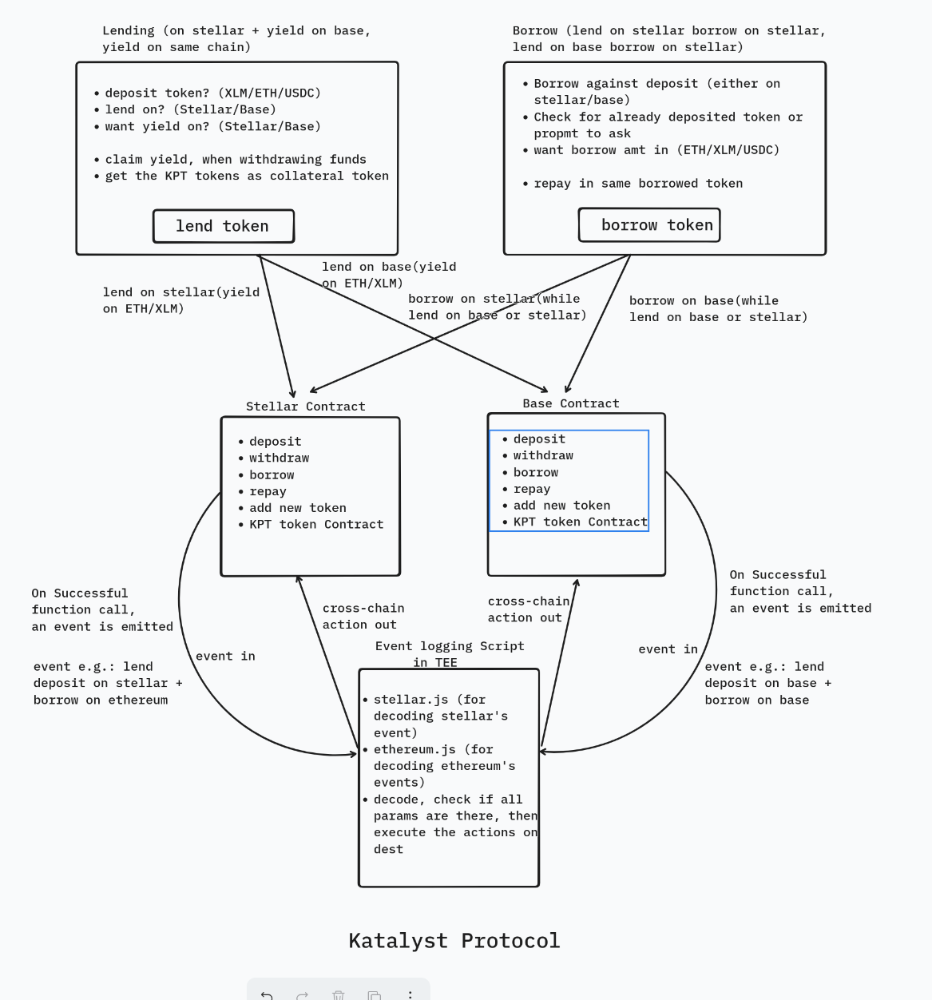
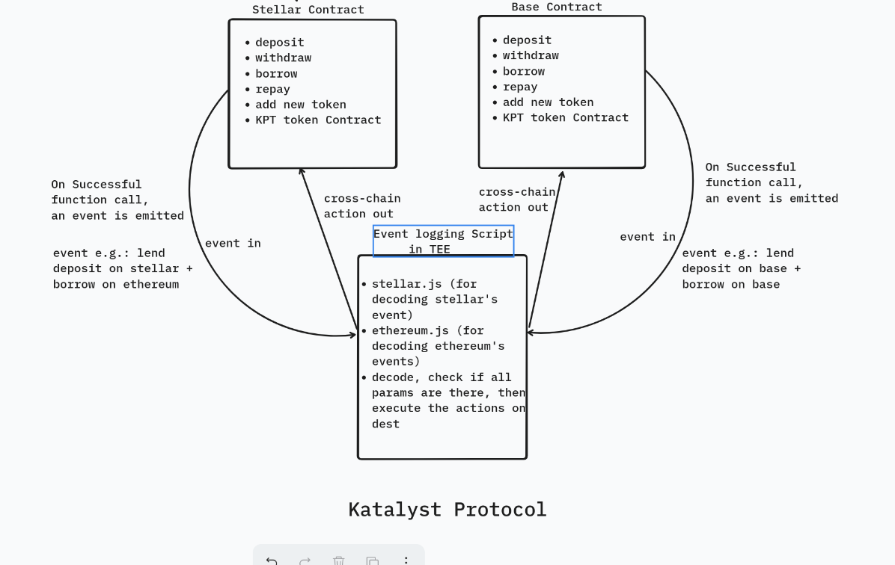

# 🌉 **Katalyst Protocol: Cross-Chain Yield-Optimized Lending**

Katalyst is a **composable cross-chain lending and borrowing protocol** for Ethereum and Stellar. It enables users to **lend on one chain, earn yield on another**, and **borrow against assets across ecosystems**, unlocking true DeFi interoperability.

---

## 🚀 Key Features

- **Composable Cross-Chain Lending & Borrowing**  
  Supply ETH, XLM, or USDC and borrow seamlessly against your position on **another chain** — powered by smart contracts and trustless relayers protocols.

- **Multi-Asset Collateralization**  
  Combine ETH, XLM, and USDC from multiple chains into a **single collateral profile**, enabling smarter borrowing limits and diversified risk.

- **Yield on Any Chain**  
  Deposit on Ethereum, earn optimized yield via Stellar, and vice versa — users can dynamically **route funds for highest yield potential**.

- **One Dashboard, Two Chains**  
  A seamless user interface to manage your lending, borrowing, positions, and rewards across Ethereum and Stellar — with one connected wallet.

---

## 🔁 Flow

---

## ⚙️ Technical Architecture

---

## 🔗 Repositories

| Component                  | Repository                                                                           |
| -------------------------- | ------------------------------------------------------------------------------------ |
| Frontend      | [katalyst-frontend](https://github.com/katalyst-protocol/frontend)                   |
| Stellar Contracts | [katalyst-stellar-contracts](https://github.com/katalyst-protocol/stellar-contract)         |
| Ethereum Contracts | [katalyst-eth-contracts](https://github.com/katalyst-protocol/ethereum-contracts)         |
| Cross-Chain Relayer for message passing      | [katalyst-relayer](https://github.com/katalyst-protocol/script)                       |

---

## 🔍 Why Katalyst Is Gud

### 1. **Composable Collateral Across Chains**
Traditional lending platforms silo assets and collateral on a single chain. Katalyst breaks this mold — enabling **users to borrow on Ethereum while posting collateral on Stellar (or vice versa)**. This **composability unlocks new capital efficiency** never before possible across major chains.

### 2. **Unified Liquidity Utilization**
Katalyst turns fragmented liquidity into **a unified borrowing power**. Users no longer need to manually bridge assets to maximize capital — the protocol does this **intelligently and automatically**, creating a seamless experience for advanced capital deployment.

### 3. **Yield Optimization by Design**
Unlike standard protocols, Katalyst **routes assets to chains where they earn the highest yield**. You’re not just lending — you’re lending **strategically**, across ecosystems. This dynamic **yield arbitrage** is normally manual or unavailable — Katalyst makes it native.

### 4. **Chain-Agnostic Experience**
From a user perspective, Katalyst feels like a **single-chain app**. Users don’t need to understand bridges, relayers, or chain mechanics — they just lend, borrow, and earn — while Katalyst handles the complexity behind the scenes.

---

## 🛠 Tech Stack

### ⚙️ Frameworks

- Next.js
- Foundry
- Stellar SDK
- Stellar CLI
- Bun

### 🧑‍💻 Languages

- TypeScript (Frontend)
- Solidity (Ethereum)
- Rust (Stellar/Soroban)

### ☁️ Deployment

- **Smart Contracts** → Ethereum + Stellar (via Soroban)
- **Relayer Script** → On Any TEE
- **Frontend** → Vercel

---

## 🔮 Roadmap

### 📍 **Core Deployment**
- Cross-chain lending & borrowing on Ethereum and Stellar  
- Secure bridge relayer integration  
- Core smart contracts for vaults, oracles, and liquidations  
- AI-based risk engine (v1)  
- **Frontend Integrations** with unified cross-chain dashboard  

### 🔁 **Stability & UX Analytics**
- Composable multi-asset collateral (lend one, borrow another)  
- Enhanced position health metrics and user analytics  
- **Smart Contract Audits** by third-party security firms  

### 🚀 **Launch & Ecosystem Support**
- **Mainnet Launch** of the protocol  
- Incentivized liquidity campaigns  
- Protocol documentation & SDK for third-party builders  
- Integration with wallets & DeFi dashboards  

### 🧠 **Optimization & Intelligence**
- AI-tuned interest rate models  
- Dynamic collateral ratios based on real-time volatility  
- Auto-routing of yield to highest-performing chains  
- Expansion of liquidation engine and off-chain monitoring  

### 🌐 **Multi-Chain Expansion**
- **Expand to Other EVM Chains** (Arbitrum, Base, Polygon, etc.)  
- Begin research into non-EVM chain bridging (e.g., Solana, Cosmos)  
- DAO-based governance rollout  
- Ongoing audits and protocol refinements  

---

## 📜 Problem Statement

> Liquidity on Ethereum and Stellar is siloed, limiting DeFi’s potential.  
> Bridging introduces complexity, cost, and risk.  
>  
> **Katalyst** solves this by enabling users to **lend or borrow across chains without moving tokens**, tapping into **Ethereum’s deep liquidity** and **Stellar’s low-cost settlement** — all through a **unified, trust-minimized protocol**.

---

## 🪪 License

This project is licensed under the MIT License.

---

## 🤝 Contributing

We love contributors! Join us by opening issues, PRs, or discussing improvements in the Issues section.
